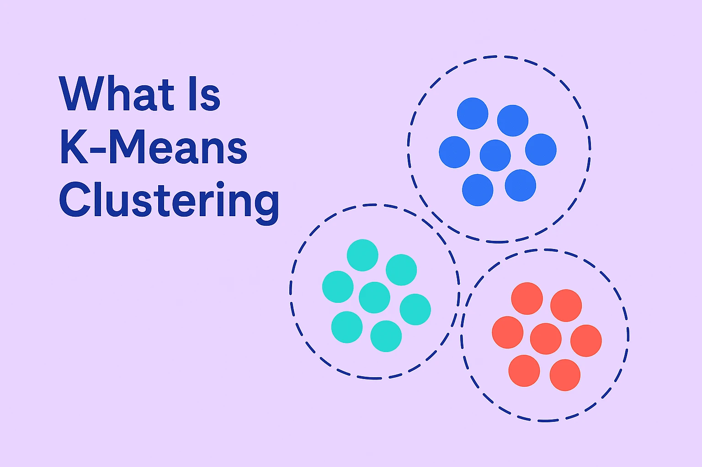
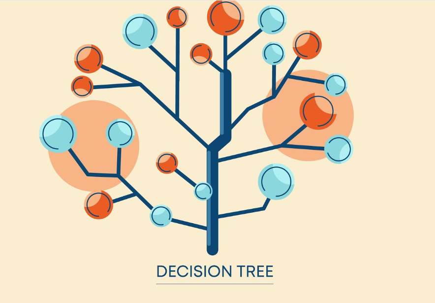

# Machine Learning Lab - Clustering and Classification

This repository contains two practical exercises focusing on key machine learning techniques: **KMeans Clustering** and **Decision Tree Classification**, performed using Python in Google Colab.

---
# 🔍 What is K-Means Clustering?

K-Means is an unsupervised machine learning algorithm used to group similar data points into K distinct clusters. It works by:

- Randomly initializing K centroids.

- Assigning each data point to the nearest centroid.

- Updating the centroids based on the average of points in each cluster.

- Repeating steps 2–3 until convergence (i.e., when cluster assignments no longer change significantly).

It is often used for customer segmentation, pattern recognition, and data compression.

## 🚀 What You’ll Learn

- Basics of unsupervised learning
- How KMeans clustering works
- Visualizing clusters in 2D space
- Choosing the optimal number of clusters (Elbow method)

## 📌 Question 01: KMeans Clustering (Unsupervised Learning)

This task demonstrates how to perform clustering using the KMeans algorithm on the `Bank.csv` dataset.

### ✅ Steps Performed:
1. Imported suitable libraries (`pandas`, `numpy`, `matplotlib`, `seaborn`, `sklearn`)
2. Loaded the dataset (`Bank.csv`) into a Google Colab notebook
3. Converted the dataset to a NumPy array
4. Plotted the Elbow Chart to identify the optimal number of clusters
5. Applied the KMeans algorithm
6. Assigned cluster labels to each record
7. Concatenated the original dataset with cluster indices
8. Visualized the clusters using a scatter plot
9. Calculated centroids for each cluster
10. Displayed cluster centroids on the scatter plot

---

## 🌳 What is a Decision Tree?

A **Decision Tree** is a supervised machine learning algorithm used for classification and regression tasks. It splits the dataset into branches based on feature values, forming a tree-like structure where:

- Each internal node represents a decision based on a feature.
- Each branch represents the outcome of that decision.
- Each leaf node represents a final class label (for classification).

It’s popular for its interpretability and ability to handle both numerical and categorical data.

---

## 📊 What is a Confusion Matrix?

A **Confusion Matrix** is a performance evaluation tool used in classification tasks. It shows how well the model's predicted labels match the actual labels. It contains:

- **True Positives (TP)**: Correctly predicted positive cases  
- **True Negatives (TN)**: Correctly predicted negative cases  
- **False Positives (FP)**: Incorrectly predicted positive cases  
- **False Negatives (FN)**: Incorrectly predicted negative cases

From this, you can derive key metrics such as:

- **Accuracy** = (TP + TN) / (TP + TN + FP + FN)  
- **Precision** = TP / (TP + FP)  
- **Recall** = TP / (TP + FN)  
- **F1 Score** = 2 * (Precision * Recall) / (Precision + Recall)

## 📌 Question 02: Decision Tree Classification (Supervised Learning)

This task illustrates how to apply a Decision Tree classifier to predict outcomes using the same `Bank.csv` dataset.

### ✅ Steps Performed:
1. Imported the required libraries (`pandas`, `sklearn.tree`, `train_test_split`, `metrics`)
2. Loaded the `Bank.csv` dataset
3. Split the dataset into features and labels
4. Removed the class variable from the feature set
5. Divided the dataset into training and test sets
6. Trained a Decision Tree classifier
7. Evaluated the model using a confusion matrix

---

## 💡 Tools Used

- Python
- Google Colab
- scikit-learn
- Matplotlib / Seaborn
- Pandas / NumPy

---

## 📎 Dataset

**Bank.csv** — Contains anonymized customer data used for clustering and classification tasks.

---

## 📈 Output Preview

### Elbow Method Plot

### Cluster Visualization

### Confusion Matrix

